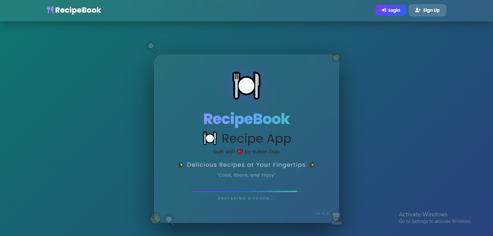
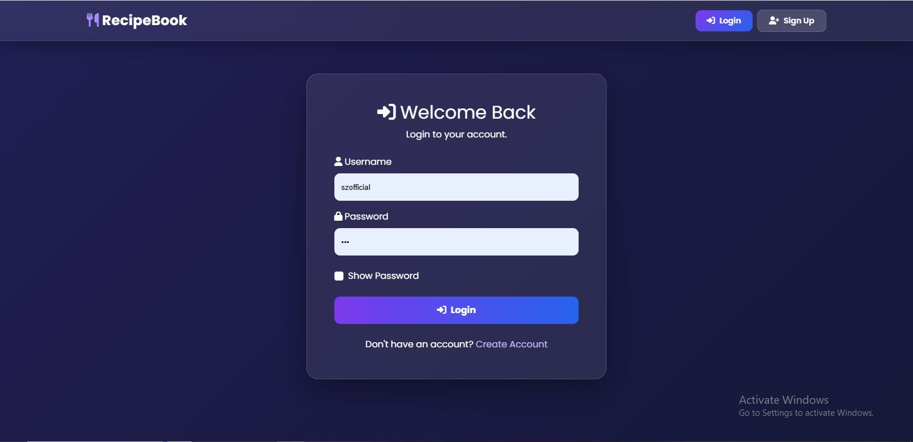
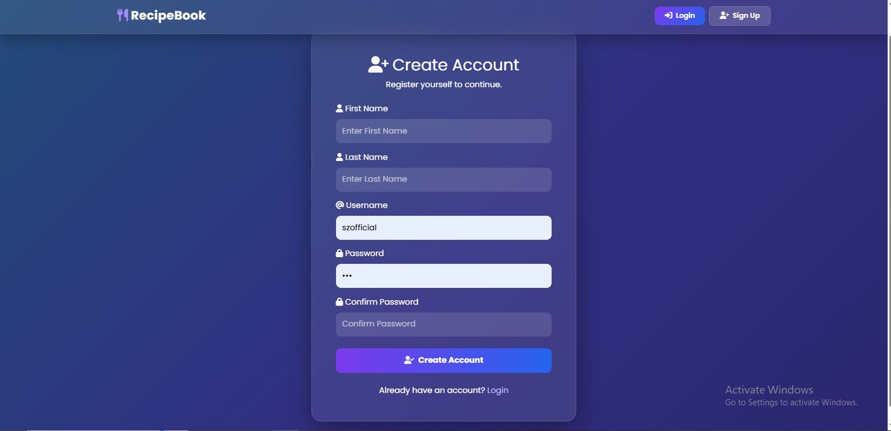
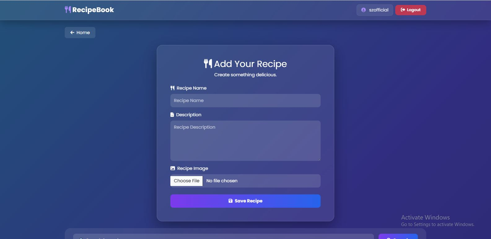
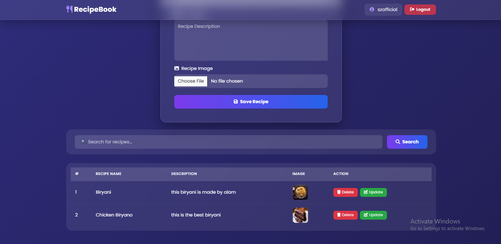
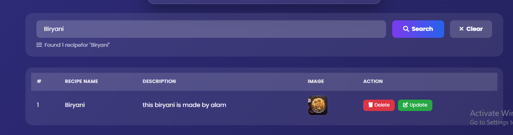
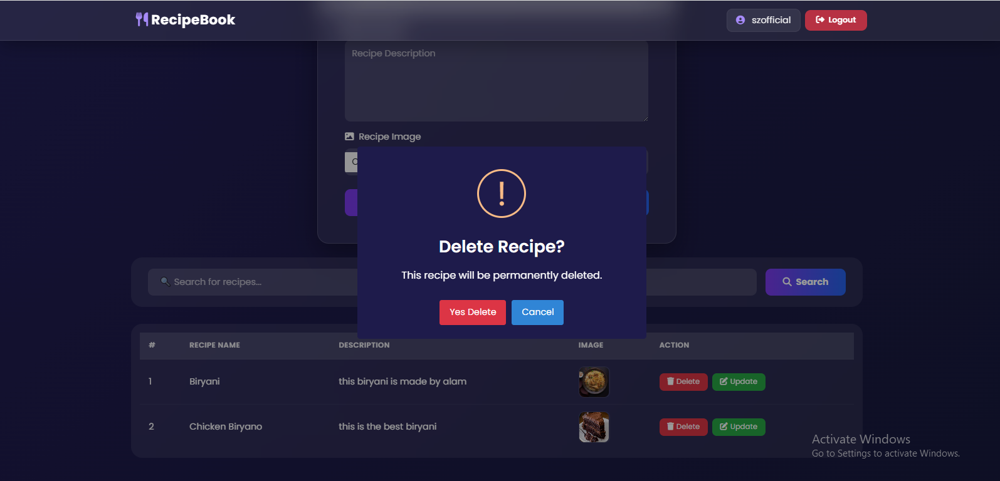
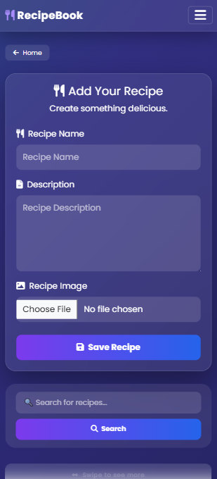

# 🍽️ RecipeBook - Django Recipe Management System

<p align="center">


</p>

---

# 📖 About Project

RecipeBook is a modern Django-based Recipe Management System where authenticated users can manage their favorite recipes.

The application provides complete CRUD functionality with a beautiful responsive interface.

Users can:

- Create Recipes
- Edit Recipes
- Delete Recipes
- Upload Recipe Images
- Search Recipes
- Login & Logout Securely

This project is designed for beginners, students, and developers learning Django CRUD with Authentication.

---

# ✨ Features

## 🔐 Authentication

- User Registration
- Login
- Logout
- Session Authentication
- Secure Password Hashing
- Django Authentication System
- Protected Routes
- Flash Messages

---

## 🍲 Recipe Management

- Add New Recipe
- Edit Existing Recipe
- Delete Recipe
- Upload Recipe Image
- Recipe Description
- Recipe Name
- View All Recipes

---

## 🔍 Search System

- Search by Recipe Name
- Instant Search Results
- Responsive Search Box

---

## 🎨 Beautiful UI

- Glassmorphism Cards
- Bootstrap 5 Layout
- Animated Background
- Responsive Navbar
- SweetAlert2
- Toast Notifications
- Hover Effects
- FontAwesome Icons
- Google Fonts

---

## 📱 Responsive Design

Supports

- Desktop
- Laptop
- Tablet
- Mobile

---

# 🛠 Tech Stack

## Backend

- Django 5
- Python 3.10+
- SQLite3
- Django ORM

## Frontend

- HTML5
- CSS3
- Bootstrap 5.3
- JavaScript
- SweetAlert2
- Font Awesome

## Tools

- Git
- GitHub
- VS Code
- Virtual Environment

---

# 📂 Project Structure

```
recipebook/
│
├── media/
│
├── public/static/
│   ├── images/
│
├── templates/
│   ├── login.html
│   ├── register.html
│   ├── recipes.html
│   ├── update.html
│
├── recipebook/
│   ├── settings.py
│   ├── urls.py
│   ├── wsgi.py
│
├── recipes/
│   ├── models.py
│   ├── views.py
│   ├── admin.py
│   ├── forms.py
│   ├── urls.py
│
├── db.sqlite3
├── manage.py
├── requirements.txt
└── README.md
```

---

# 🚀 Installation Guide

## 1 Clone Repository

```bash
https://github.com/szofficiall/Recipe-CRUD-App-with-Django---Full-Stack-Project-.git

cd Recipe-CRUD-App-with-Django---Full-Stack-Project-
```

---

## 2 Create Virtual Environment

### Windows

```bash
python -m venv venv

venv\Scripts\activate
```

### Linux / Mac

```bash
python3 -m venv venv

source venv/bin/activate
```

---

## 3 Install Requirements

```bash
pip install -r requirements.txt
```

---

## 4 Required Packages

```txt
Django==6.0.7

Pillow==10.3.0

python-dotenv==1.0.1

django-crispy-forms==2.1

crispy-bootstrap5==0.7
```

---

## 5 Apply Migrations

```bash
python manage.py makemigrations

python manage.py migrate
```

---

## 6 Create Superuser

```bash
python manage.py createsuperuser
```

---

## 7 Run Server

```bash
python manage.py runserver
```

Open

```
http://127.0.0.1:8000/
```

---

# 💾 Database

Default Database

```
SQLite3
```

Can easily migrate to

- PostgreSQL
- MySQL
- MariaDB

---

# 🔑 Default Flow

Register

↓

Login

↓

Add Recipe

↓

Edit Recipe

↓

Delete Recipe

↓

Logout

---

# 📸 Screenshots


## 🏠 Home Page



---

## 🔑 Login Page



---

## 📝 Registration Page



---

## 📋 Dashboard



---

## ➕ Add Recipe



---

## 🔍 Search Recipe



---

## ❌ Delete Confirmation



---

## 📱 Mobile Dashboard


---

---

# 🎯 Future Improvements

- Email Verification
- Forgot Password
- Recipe Categories
- Favorites
- User Profiles
- Comments
- Ratings
- Dark Mode
- REST API
- Docker Support
- AWS Deployment
- PostgreSQL Support

---

# 🔒 Security

- CSRF Protection
- Authentication Required
- Session Security
- Password Hashing
- Django Security Middleware

---

# 🤝 Contributing

Contributions are welcome.

1. Fork Repository

2. Create Branch

```
git checkout -b feature-name
```

3. Commit Changes

```
git commit -m "Added New Feature"
```

4. Push

```
git push origin feature-name
```

5. Open Pull Request

---

# 🧪 Testing

Run Tests

```bash
python manage.py test
```

---

# 🌍 Deployment

You can deploy on

- PythonAnywhere
- Render
- Railway
- Heroku
- VPS
- DigitalOcean

---

# 📄 License

## Custom License

Copyright © 2026

**Muhammad Saad Zafar**

This project is created for educational and portfolio purposes.

### Restrictions

❌ You may NOT:

- Claim this project as your own.
- Remove the original author credit.
- Sell this project.
- Upload modified versions without giving credit.
- Copy the source code for commercial purposes without written permission.

✅ You MAY:

- Learn from the source code.
- Use it for educational purposes.
- Fork the repository.
- Improve it with proper attribution.
- Share with author credit.

If you wish to use this project commercially, contact the author first.

---

# 👨‍💻 Developer

## Sultan Zaib

**Full Stack Developer | Software Engineer**


🌐 GitHub: https://github.com/szofficiall


---

# ⭐ Support

If you like this project

⭐ Star the Repository

🍴 Fork the Repository

💙 Share with Friends

---

# 🙏 Acknowledgements

- Django Team
- Bootstrap Team
- Font Awesome
- SweetAlert2
- Python Community

---

<p align="center">

Made with ❤️ by <b>Sultan Zaib</b>

</p>
